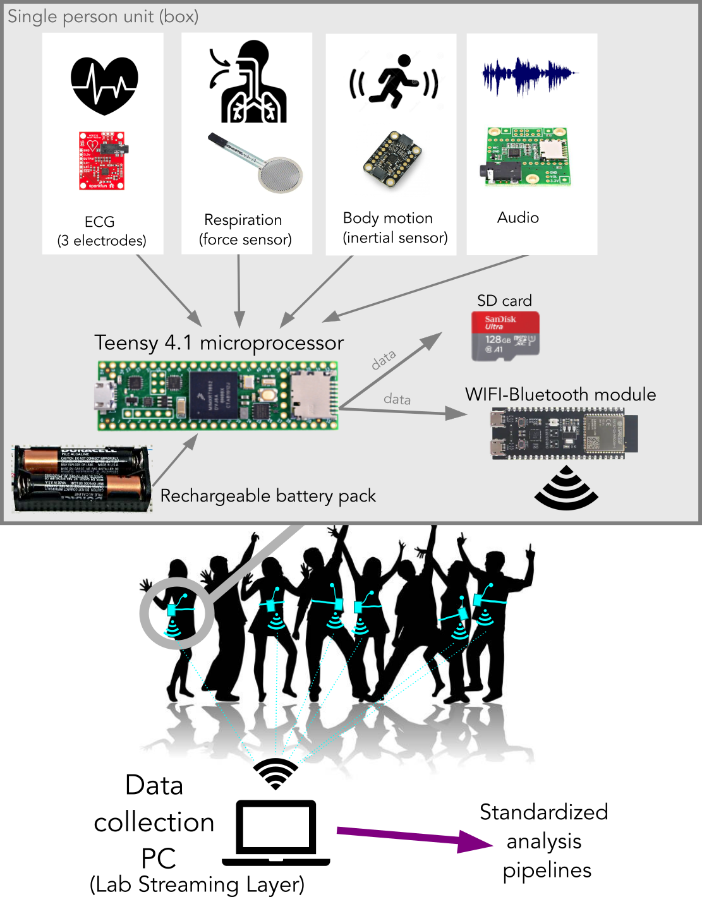

# BRAMSBioBox: Developing an Open Research Platform for Audio and Biosignals Monitoring

## Authors

- Floris van Vugt  
  International Laboratory for Brain, Music and Sound Research (BRAMS), Montréal, Canada  
  Département de Psychologie, Université de Montréal, Montréal, Canada  
  Center for Research on the Brain, Language and Music (CRBLM), Montréal, Canada  
  [floris.van.vugt@umontreal.ca](mailto:floris.van.vugt@umontreal.ca)

- Valentin Pintat  
  École de technologie supérieure, Montréal, Canada  
  [vpintat@critias.ca](mailto:vpintat@critias.ca)

- Dawn Merrett  
  International Laboratory for Brain, Music and Sound Research (BRAMS), Montréal, Canada  
  Département de Psychologie, Université de Montréal, Montréal, Canada  
  Center for Research on the Brain, Language and Music (CRBLM), Montréal, Canada  
  [dawnmerrett@gmail.com](mailto:dawnmerrett@gmail.com)

- Simone Dalla Bella  
  International Laboratory for Brain, Music and Sound Research (BRAMS), Montréal, Canada  
  Département de Psychologie, Université de Montréal, Montréal, Canada  
  Center for Research on the Brain, Language and Music (CRBLM), Montréal, Canada  
  [simone.dalla.bella@umontreal.ca](mailto:simone.dalla.bella@umontreal.ca)

- Jérémie Voix  
  International Laboratory for Brain, Music and Sound Research (BRAMS), Montréal, Canada  
  École de technologie supérieure, Montréal, Canada  
  Center for Research on the Brain, Language and Music (CRBLM), Montréal, Canada  
  [jeremie.voix@etsmtl.ca](mailto:jeremie.voix@etsmtl.ca)

## Introduction

### Context

Music is an inherently social phenomenon. Virtually all cultures use music in the context of group rituals, parent-to-infant connection, or to reinforce social identity. A key feature of music is thus the social context in which it is embedded. Research on music, as well as neuroscience at large, is progressively moving from studying individual humans in sterile audio booths to investigating multiple humans simultaneously engaging interactively in real-world musical behaviors, for example, dancing to music or creating a joint beat in social drumming. 

A unique window into social dynamics that unfold under these conditions is our physiology: cardiac rhythms, respiration, and perspiration. These physiological signals are linked not only to emotions[^1], which are a crucial element of music experience, but also to elusive social constructs such as rapport[^2][^3], affiliation[^4], and group dynamics[^5][^6]. Since these measures tap into the autonomous nervous system, they allow us to tap into implicit processes underpinning our reaction to music. Physiological measures are less prone to subjective or social desirability biases and thus more reliable than self-reported measures typically used. 

What is more, physiological measures can be collected continuously. This possibility offers an unparalleled opportunity to capture the interaction process as it is unfolding, without having to interrupt participants at various points in time to ask them to complete a questionnaire. These measures can then be compared between participants in an activity, for example by probing how musical activities synchronize respiration and cardiac rhythms. Such physiological linkage has been shown to predict the amount of social affiliation[^4]. Thus, studying the physiology of multiple participants interacting in musical contexts is a key avenue to understanding the social nature of music[^7].

### Challenge

In order to record the physiology of multiple participants simultaneously in real-life settings, we need to solve a number of methodological challenges:
1. Data of different modalities needs to be collected simultaneously: cardiac signals, respiration, motion, and audio, to name but a few;
2. Recordings from multiple participants need to be aligned in time, that is, we need to know which moment in one participant's time series corresponds to the same moment in another participant's;
3. Data needs to be collected wirelessly, so that participants can move unimpeded as they would in natural musical settings (nothing as annoying as tripping over a wire while showing off your summit dance move);
4. The setup needs to be scalable, so that in principle more devices can be added allowing measurement of dozens or more participants.

Existing frameworks: Commercial frameworks exist that do some combinations of the above. These solutions typically do not provide tangible guarantees about synchronization, such as upper limits on time delays, which, especially when it comes to audio, is critical for music research. Indeed, when put to the test these solutions often perform only moderately well[^8]. Moreover, their price tags are several thousand dollars per unit and upwards. Such prices make these units impractical for studying real-life musical behaviors because we cannot buy as many of them as are needed for studying group behaviors, let alone carry them out of the lab as we need to do if we want to study real-life musical behaviors in concert halls, dance venues, or parks. What is needed is a device that is fully synchronized across modalities and between people, low-cost, portable, non-invasive, and scalable.

## Method

### Proposed Solution

In this project, we will develop an elegant solution that delivers on all these requirements. The design (see figure below) is based on a recently published framework for measuring the physiology of a single person[^9]. We will produce a custom 3D-printed box, roughly the size of a cell phone, which contains a Teensy microcontroller - essentially a small computer. This microcontroller reads a handful of sensors (more can be added) that tap into respiration, cardiac signals, whole-body movement, as well as audio, for a single participant. The data is stored locally on an SD card, from which we can, after the experiment, download the data for offline analysis. The data is also transmitted in real-time through a WiFi signal. The device is powered by a battery and attached to a belt worn by the participant. 

Electrocardiogram (ECG) sensors are attached to participants' bodies and respiration is measured using a belt over their thorax which contains a force sensor, measuring contraction and expansion of the chest to assess respiration. Multiple participants each wear one such device, which can operate simultaneously in parallel, streaming their data to a central PC. This computer records the incoming data in a synchronized manner, using the Laboratory Streaming Layer (LSL)[^10], which cleverly estimates the delays in each of the data streams coming from the various devices, in order to realign them in time. Data will be available for online visualization routines but also saved in the standardized HDF5 data format. Further preprocessing pipelines will be developed.

### Validation Experiment

To test whether this proposed solution delivers on all promises, and to assess its precision and reliability, we will test this on five groups of four participants who engage in a joint clapping task. This experiment will be performed in the BRAMS laboratories so that we can compare the to-be-developed device with an existing commercial solution, representing our ground truth. We will compare the data collected by the two frameworks using correlation (to test agreement) and absolute differences (to test discrepancies), following validation experiments for other devices[^11][^12].

## Perspectives

The potential research applications for this device are many. For example, in its current form it can be used, as we are planning to, to measure the dynamics of social cohesion in choirs. We can study the intensity of emotional experience of a group dancing to music at a party. We can map out whether emotions are shared between performers in a concert hall and their audience. Other sensors can be added straightforwardly, such as galvanic skin response to measure stress and psychological safety. Future work can also expand on this design where data captured by these devices are streamed live and in synchrony to a central computer for biofeedback purposes. Other sensors are also currently being integrated, such as a thermoresistor for respiration sensing and a photoplethysmography (PPG) sensor on the earlobe. 

The BRAMSBioBox device design blueprint as well as all code that will be developed will be made available freely on GitHub, and all relevant documentation will be made available at [BioARP website](https://bioarp.org) that is also a gateway hub for any future commercial offer of such open hardware & software platform for the research community.

## Acknowledgments

This work was supported by the Centre for Research on Brain, Language and Music (CRBLM) Research Incubator Award (RIA). The authors thank Mr. Dhairya Shah, intern at ÉTS sponsored by the MITACS Globalink program, as well as Mrs. Alexandre Demczuk and Elia Mélé, interns at ÉTS, for their work sponsored by the CRBLM IRA.

[^1]: Bradley, M. M., & Lang, P. J. (2000). Affective reactions to acoustic stimuli.
[^2]: Tschacher, W., Rees, G. M., & Ramseyer, F. (2020). Nonverbal synchrony and affect in dyadic interactions.
[^3]: Marci, C. D., Ham, J., Moran, E. K., & Orr, S. P. (2007). Physiologic evidence for the interpersonal role of emotions.
[^4]: Danyluck, C., & Page-Gould, E. (2019). Social and physiological synchrony: An examination of social exclusion.
[^5]: M, H., et al. (2016). Social neuroscience of synchrony.
[^6]: Tomashini, A., & Grossman, M. (2016). Interpersonal synchrony and empathy.
[^7]: Wright, M., et al. (2022). Social dynamics of musical interaction.
[^8]: Menghini, L., et al. (2019). Limitations of current wearable devices in detecting physiological synchrony.
[^9]: Maitha, J., et al. (2020). Framework for measuring physiology in a single person.
[^10]: Blum, J., et al. (2021). Laboratory Streaming Layer: A unified framework for measuring time delays.
[^11]: Schultz, S. E., et al. (2016). Validation of physiological measurements in a group setting.
[^12]: Van Vugt, F. T., et al. (2020). Comparing physiological synchrony across devices.
